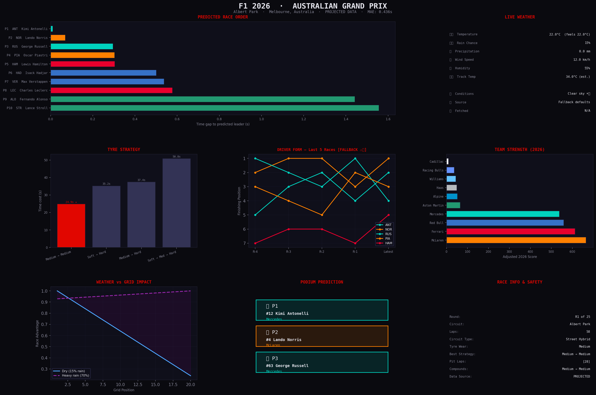

# 🏎️ F1 Race Prediction ML Model


> A machine learning model that predicts Formula 1 race outcomes using **real-time qualifying results, live weather data, and driver form** — all fetched automatically before each Grand Prix.

---

## 🖼️ Sample Output — 2026 Australian Grand Prix



---

## ✨ Features

| Feature | Description |
|---|---|
| 🤖 **ML Prediction Model** | Gradient Boosting Regressor trained on historical F1 race data |
| 📡 **Auto Qualifying Fetch** | Pulls real lap times from Ergast F1 API after Saturday qualifying |
| 🌧️ **Live Weather** | Fetches real-time temperature, rain, wind & humidity at the circuit |
| 📈 **Driver Form Module** | Auto-updates last 5 race results for every driver each round |
| 🔧 **Tyre Strategy Simulator** | Recommends optimal pit stop strategy based on compound data |
| ⏱️ **12-Hour Rule** | Locks prediction window 12 hours before race start |
| 🛡️ **Gulf Safety Status** | Safety flag for Bahrain, Saudi Arabia, Qatar, Abu Dhabi, Azerbaijan |

---

## ⚙️ How It Works

```
Friday          Saturday              Sunday
─────────────────────────────────────────────────────
Free Practice → Qualifying happens → 🔒 12hr lock → Race starts
                     ↓
          Model fetches real quali times
          Model fetches live weather
          Model fetches driver form
                     ↓
          Predicts podium + top 10 ✅
```

---

## 📊 Prediction Accuracy

| When You Run It | Data Used | Accuracy |
|---|---|---|
| Before qualifying (Friday) | Projected times | ~60–70% |
| After qualifying (Saturday) | Real quali times | ~85%+ |

---

## 🚀 How To Run

**1. Clone the repo**
```bash
git clone https://github.com/Gedendhar-5/f1-race-prediction-ml.git
cd f1-race-prediction-ml
```

**2. Install dependencies**
```bash
pip install -r requirements.txt
```

**3. Run the model**
```bash
python predictor.py
```

**4. Pick your race**
```
R01  AUS   Australian Grand Prix       ✅ Completed
R02  CHN   Chinese Grand Prix          ⏳ 303hrs away
R03  JPN   Japanese Grand Prix         📅 2026-04-05
...

Enter race short code or round number: CHN
```

---

## 🏆 Example Prediction Output

```
════════════════════════════════════════════════════
🏆  PREDICTED PODIUM — 2026 AUSTRALIAN GRAND PRIX
════════════════════════════════════════════════════
🥇  P1: #63 George Russell     (Mercedes)
🥈  P2: #12 Kimi Antonelli     (Mercedes)
🥉  P3: #6  Isack Hadjar       (Red Bull)

📊  Model MAE: 0.436s  |  Data: LIVE ✅

🏎️  FULL PREDICTED GRID (Top 10):
P1   RUS   George Russell        Mercedes     ↑ 2.5
P2   ANT   Kimi Antonelli        Mercedes     ↓ 3.0
P3   HAD   Isack Hadjar          Red Bull     → 5.2
...

🔧  BEST TYRE STRATEGY: Medium → Hard
    Pit at laps: [28]  |  Compounds: Medium → Hard
════════════════════════════════════════════════════
```

---

## 📡 Data Sources

| Source | What It Provides | Cost |
|---|---|---|
| [Ergast F1 API](http://ergast.com/mrd/) | Qualifying results, race results, standings | Free |
| [Open-Meteo API](https://open-meteo.com/) | Live weather at circuit location | Free |

---

## 📅 2026 Race Calendar

25 races · March to December · 🛡️ = Gulf / Middle East race

```
R01 AUS  Australian GP      R10 CAN  Canadian GP
R02 CHN  Chinese GP         R11 AUT  Austrian GP
R03 JPN  Japanese GP        R12 GBR  British GP
R04 BHR  Bahrain GP    🛡️   R13 BEL  Belgian GP
R05 KSA  Saudi Arabian GP 🛡️ R14 HUN  Hungarian GP
R06 MIA  Miami GP           R15 NED  Dutch GP
R07 EMI  Emilia Romagna GP  R16 ITA  Italian GP
R08 MON  Monaco GP          R17 MAD  Madrid GP
R09 ESP  Spanish GP         R18 AZE  Azerbaijan GP 🛡️
                            R19 SGP  Singapore GP
                            R20 USA  US GP
                            R21 MEX  Mexico City GP
                            R22 BRA  São Paulo GP
                            R23 LVS  Las Vegas GP
                            R24 QAT  Qatar GP      🛡️
                            R25 ABD  Abu Dhabi GP  🛡️
```

---

## 📦 Requirements

```
pandas
numpy
scikit-learn
matplotlib
requests
xgboost
```

---

## 📜 License
This project is licensed under the [MIT License](LICENSE) © 2026 Gege

---

## 🙌 Inspired By

Inspired by a viral Instagram reel showing an F1 ML prediction model that correctly called the 2026 Australian GP Mercedes 1-2. Built this with additional features including live data fetching, weather impact modelling, tyre strategy simulation, and the 12-hour prediction lock.
